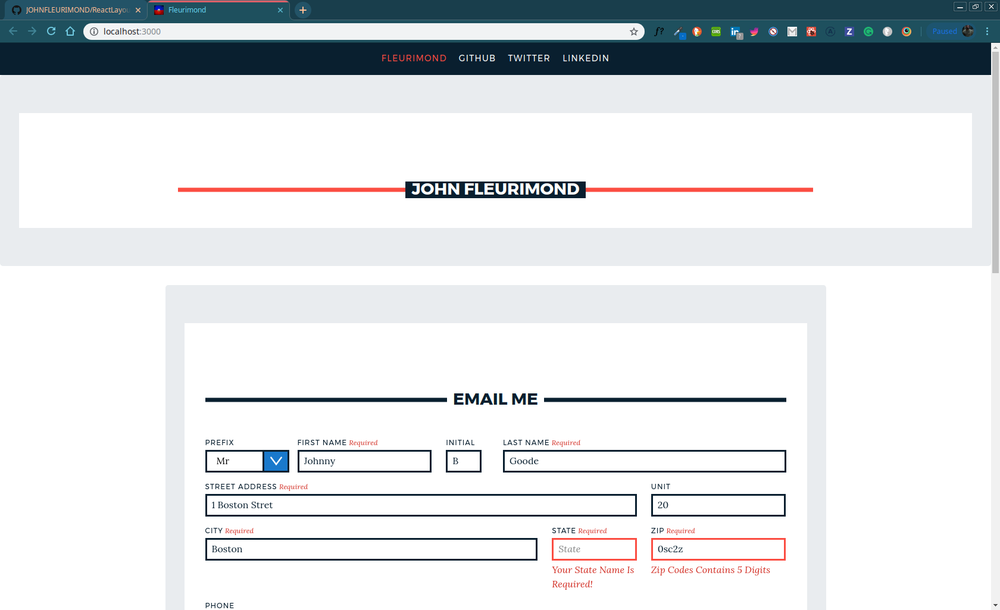

# :checkered_flag:What It Looks Like :checkered_flag:: 



# How It's Made :nut_and_bolt:🔨 :hammer::wrench::
 This application built with React.js, Express, Node, Passport, & Using MySql for a database.

## Optimizations📶.
The app is done, I would love to start diving deeper in Query Languages like `graphQL` and see if I can get a query with `getInitialProps` with `Next.js` so having the files on the server rending which renders React components on the server before the HTML. Automatic routing so I wouldnt have to set up react-router even though I got better with it. I just want to get back to it since it had its Benefits. 

 # How It's Works:white_check_mark::
1.) A user can send form data to MySql Database Table.

2.) User can see the json data once submit as an alert!

# My Awesome Project 🖥 & Lessons Learned :mortar_board:  
I learned how to use MySQL and I am getting better and better with Node and Express, the more I have to buid my own server.This is a MERN-Stack Email application that allows data to be submit via Formik and Yup validation. As you may know, React is a JavaScript library for building user interfaces. That’s it. It’s a way to use JavaScript to define UI elements based on user-defined properties and internal state. Let me talk about the Frameworks I used and I am going to show you some examples.

```//------
import React, { Component } from 'react'
 
export default class SimpleForm extends Component {
  state = {
    searchTerm: '',
  }
 
  handleSubmit = event => {
    event.preventDefault() // prevent form post
    this.props.onSearch(this.state.searchTerm)
  }
 
  handleSearch = event => {
    const searchTerm = event.target.value
    this.setState((prevState, props) => ({
      searchTerm,
    }))
  }
 
  render = () => (
    <div>
      <form onSubmit={this.handleSubmit}>
        <input
          type="text"
          placeholder="Search games"
          value={this.state.searchTerm}
          onChange={this.handleSearch}
        />
        <input type="submit" value="Submit" />
      </form>
    </div>
  )
}
```

With Formik, You can use it as a higher-order component or a render callback (also applicable as a child function). This allows for greater flexibility in the props and state, as well as enhanced composability. There is also no need to track the state of the form elements explicitly. You can allow your form to handle itself, which is one of the key elements of React and a component-based architecture.Formik leans on Yup for validation. This provides a simple, yet powerful, way to validate an object schema for your form controls. The validationSchema prop takes a Yup schema or a function that returns one. There are many types of validators, such as for objects, strings, numbers, dates, etc. You can also create your own. The validators can be chained to allow precise constraints for acceptable values.


```//------
import React, { Component } from 'react'
import TextInput from './TextInputFormik'
import { Formik, Form, Field } from 'formik'
import Yup from 'yup'
import isEmpty from 'lodash/isEmpty'
 
export default class AddGameForm extends Component {
  render() {
    return (
      <div className="addGameForm">
        <Formik
          validationSchema={Yup.object().shape({
            title: Yup.string()
              .min(3, 'Title must be at least 3 characters long.')
              .required('Title is required.'),
          })}
          initialValues={{
            title: 'asdf',
            releaseYear: '',
            genre: '',
            price: '12',
          }}
          onSubmit={(values, actions) => {
            // this could also easily use props or other
            // local state to alter the behavior if needed
            // this.props.sendValuesToServer(values)
 
            setTimeout(() => {
              alert(JSON.stringify(values, null, 2))
              actions.setSubmitting(false)
            }, 1000)
          }}
          render={({ values, touched, errors, dirty, isSubmitting }) => (
            <Form>
              <Field
                type="text"
                name="title"
                label="Title"
                component={TextInput}
              />
              <Field
                type="text"
                name="releaseYear"
                label="Release Year"
                component={TextInput}
              />
              <Field
                type="text"
                name="genre"
                label="Genre"
                component={TextInput}
              />
              <Field
                type="text"
                name="price"
                label="Price"
                component={TextInput}
              />
              <button
                type="submit"
                className="btn btn-default"
                disabled={isSubmitting || !isEmpty(errors) || !dirty}
              >
                Add Game
              </button>
            </Form>
          )}
        />
      </div>
    )
  }
}
```

# Express, Nodemon, Body-Parser, Cors

The first thing I wanted to do is to create a server where browsers can connect to. We can do so with the help of a listen method provided by Express You define routing using methods of the Express app object that correspond to HTTP methods; for example, app.get() to handle GET requests and app.post to handle POST requests. Like app.METHOD or You can also use app.all() to handle all HTTP methods and app.use() to specify middleware as the callback function and using Nodemon to restart the server automatically whenever I or the user save a file that the server uses.

```//------

const express = require('express');
const app = express();

app.use(express.json());
```

```//------
app.listen(8080, function() {
  console.log('listening on 3000')
})
```
or 

```//------
const PORT = process.env.PORT || 8080;

app.listen(PORT, () => {
    console.log(`Our app is running on port ${PORT}`);
});
```

Express allows us to add middleware like body-parser to our application with the use method. You’ll hear the term middleware a lot when dealing with Express. These things are basically plugins that change the request or response object before they get handled by our application. Make sure you place body-parser before your CRUD handlers!
// Parse incoming requests data (https://github.com/expressjs/body-parser)

```//------
const express = require('express')
const bodyParser= require('body-parser')
const app = express()

app.use(
    bodyParser.urlencoded({
        extended: true,
    })
);
// All your handlers here...
```
A request for a resource (like an image or a font) outside of the origin is known as a cross-origin request. CORS (cross-origin resource sharing) manages cross-origin requests.

Cross-origin requests, however, that means servers must implement ways to handle requests from origins outside of their own. CORS allows servers to specify who (i.e., which origins) can access the assets on the server, among many other things.

The CORS standard is needed because it allows servers to specify not just who can access its assets, but also how the assets can be accessed.

```//------

const cors = require('cors');

app.use(cors());
```

# MySql
I would say it wasn't that hard to set up everything but MySQL is a database management system. A database is a structured collection of data, MySql is a Software delivers a very fast, multithreaded, multi-user, and robust SQL (Structured Query Language). It may be anything from a simple shopping list to a picture gallery or the vast amounts of information in a corporate or non-corperate network. MySQL databases are relational. A relational database stores data in separate tables rather than putting all the data in one big storeroom. The database structures are organized into physical files optimized for speed. The logical model, with objects such as databases, tables, views, rows, and columns, offers a flexible programming environment. 

To use MySql you have to first download the community version and have created a root password for your account.  To create a database you have to log via command line by typing this command.. `mysql -u root -p`, I learned that if you get a command not found you can add the path by entering these commands:

### Current Session
`export PATH=${PATH}:/usr/local/mysql/bin`
### Permanantly
`echo 'export PATH="/usr/local/mysql/bin:$PATH"' >> ~/.bash_profile`

Once logged in, you could create a database query by entering this command `CREATE DATABASE test;` and to use it `USE test;` but to delete `DROP DATABASE test;`.

To Create a user query it is just as easy. 

```//------
CREATE TABLE users(
id INT AUTO_INCREMENT,
   first_name VARCHAR(100),
   last_name VARCHAR(100),
   email VARCHAR(50),
   password VARCHAR(20),
   location VARCHAR(100),
   dept VARCHAR(100),
   is_admin TINYINT(1),
   register_date DATETIME,
   PRIMARY KEY(id)
);
```

& to show this table `SHOW USERS;` or `DESCRIBE USERS;` will show you the users table that we created in the console the and to delete the table users enter `DROP TABLE USERS;`

To insert data Insert Row / Record query you have to put it in the same order as the create table query:

```//------
INSERT INTO users (first_name, last_name, email, password, location, dept, is_admin, register_date) values ('John', 'Fleurimond', 'Boston@gmail.com', '02124','Massachusetts', 'development', 1, now());
```


That was easy, the hard part was to connect the back end using Node, Express, Sequelize which I never used before but Sequelize is a  ORM or Object Relation Mapping is a process of mapping between objects and relation database systems. An ORM acts like an interface between two system. Sequelize is a promise-based ORM for Node.js apps that use Postgres, MySQL, MariaDB, SQLite and Microsoft SQL Server. Just like Mongoose is for MongoDB (Documents), which is a non-relational database vs MySQL is relational (Tables) but less about that and more about the code...

Just like Mongoose does for mongoDB, In MySql you have to create a schema to define the user using Sequelize.

```//------
const Sequelize = require('sequelize');
const db = require('../database/db.js');

module.exports = db.sequelize.define(
    'user',
    {
        id: {
            type: Sequelize.INTEGER,
            primaryKey: true,
            autoIncrement: true,
        },
        firstName: {
            type: Sequelize.STRING,
        },
        middleName: {
            type: Sequelize.STRING,
        },
        lastName: {
            type: Sequelize.STRING,
        },
        phone: {
            type: Sequelize.INTEGER,
        },
        created: {
            type: Sequelize.DATE,
            defaultValue: Sequelize.NOW,
        },
    },
    {
        timestamps: false,
    }
);
```
and connect to the database: 

```const Sequelize = require('sequelize');

module.exports =  new Sequelize('acme', 'root', 'Hellodear83!', {
  host: 'localhost',
  port: '3306',
  dialect: 'mysql',

  pool: {
    max: 10,
    min: 0,
    acquire: 30000,
    idle: 10000,
  },
});
```


# Portfolio :open_file_folder::

** :computer: 🇭🇹  WEBSITE:** [John Fleurimond](http://johnfleurimond.com)

# How To Get It Started :arrow_forward: :

## Installation

1. Clone repo
2. run `npm install`

## Available Scripts

In the project directory, you can run:

### `npm run dev`

Runs the app in the development mode.<br>
Open [http://localhost:3000](http://localhost:3000) to view it in the browser.

The page will reload if you make edits.<br>
You will also see any lint errors in the console.

### `npm test`

Launches the test runner in the interactive watch mode.<br>
See the section about [running tests](#running-tests) for more information.

### `npm run build`

Builds the app for production to the `build` folder.<br>
It correctly bundles React in production mode and optimizes the build for the best performance.

The build is minified and the filenames include the hashes.<br>
Your app is ready to be deployed!

See the section about [deployment](#deployment) for more information.
### `npm run prettier`
This corrects the format.

### `npm run eject`

**Note: this is a one-way operation. Once you `eject`, you can’t go back!**

If you aren’t satisfied with the build tool and configuration choices, you can `eject` at any time. This command will remove the single build dependency from your project.

Instead, it will copy all the configuration files and the transitive dependencies (Webpack, Babel, ESLint, etc) right into your project so you have full control over them. All of the commands except `eject` will still work, but they will point to the copied scripts so you can tweak them. At this point you’re on your own.

You don’t have to ever use `eject`. The curated feature set is suitable for small and middle deployments, and you shouldn’t feel obligated to use this feature. However we understand that this tool wouldn’t be useful if you couldn’t customize it when you are ready for it.

